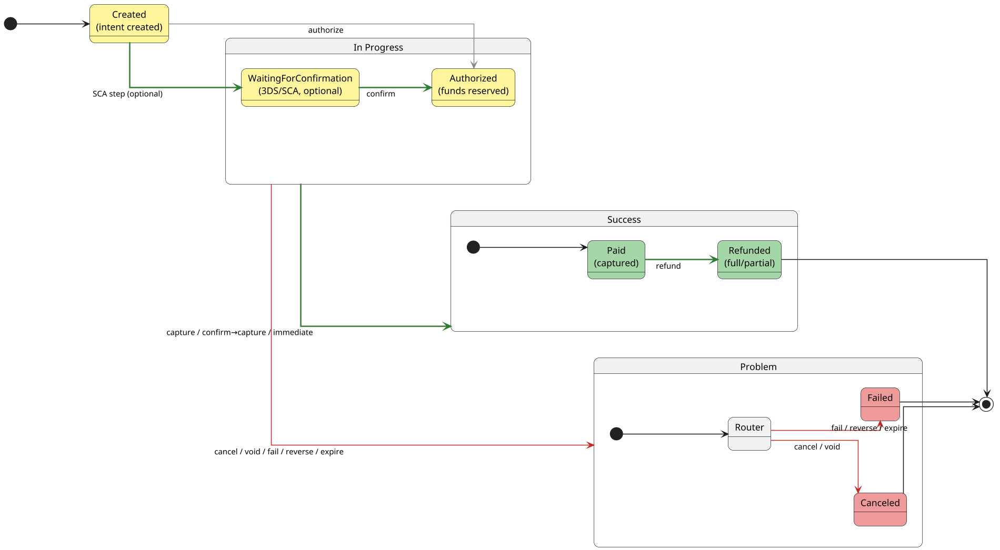

### Flow of a Payment

### Refund semantics

- Partial refunds do **not** change the state: the payment remains **PAID**.
- A **full** refund moves the payment to **REFUNDED** (terminal).
- Additional refunds after full refund are not allowed.